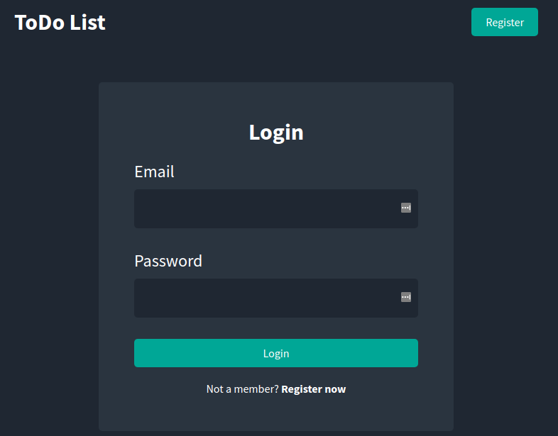
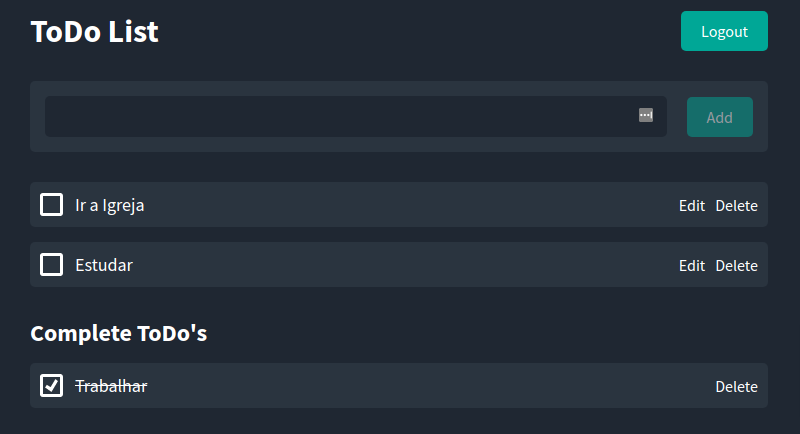

<p align="center">
  
</p>

<p align="center">
  <a href="#-technologies">Technologies</a>&nbsp;&nbsp;&nbsp;|&nbsp;&nbsp;&nbsp;
  <a href="#-getting-started">Getting started</a>&nbsp;&nbsp;&nbsp;|&nbsp;&nbsp;&nbsp;
  <a href="#-project">Project</a>&nbsp;&nbsp;&nbsp;|&nbsp;&nbsp;&nbsp;
  <a href="#-layout">Layout</a>&nbsp;&nbsp;&nbsp;|&nbsp;&nbsp;&nbsp;
  <a href="#-next-steps">Next steps</a>
</p>

<h1 align="center">
  <a href="#" target="_blank">
    REACT TODOLIST
  </a>
</h1>

---

## 🧪 Technologies

This project was developed using the following technologies:

- [React](https://pt-br.reactjs.org/)
- [Node](https://nodejs.org/)
- [Sass](https://sass-lang.com/)

## 🚀 Getting started

Clone the project and access the folder

```bash
$ git clone https://github.com/eltonsantos/react-todolist.git && cd react-todolist
```

Follow the steps below
```bash
# Install the dependencies
$ npm install

# Start the project
$ npm run dev
```

## 💻 Project

A simple project of a ToDo list. The project separates the front from the backend, where the front was developed using React and the backend using Node. The database used is Mongo. The project is based on playlist: https://www.youtube.com/watch?v=JHn-aIEeBeA&list=PL1GlgOJ9R3jgBuLQtSXrEs70iJbl3Ch49

## 🔖 Layout

<p align="center">
  
</p>

## 🐾 Next steps

###### Escreverei essa parte em português

- [ ] Cobrir o sistema de testes! 👁‍🗨
- [ ] Criar uma busca da lista de tarefas 🔎
- [ ] E muito mais... ❤💪🏼

---

## 👨🏻‍💻 Author

<h3 align="center">
  
  <br/>
  <strong>Elton Santos</strong> 🚀
  <br/>
  <br/>

 <a href="https://www.linkedin.com/in/eltonmelosantos" alt="LinkedIn" target="blank">
    
  </a>

  <a href="mailto:elton.melo.santos@gmail.com?subject=Olá%20Elton" alt="Email" target="blank">
    
  </a>

<br/>

Made with ❤️ by Elton Santos 👋🏽 [Entre em contato!](https://www.linkedin.com/in/eltonmelosantos/)

</h3>